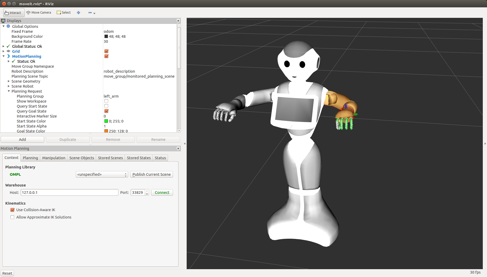

pepper_moveit_config
===================

This is a MoveIt! config package generated by the MoveIt! wizard.
It requires a Pepper model which you can get from here:

https://github.com/ros-naoqi/pepper_robot/tree/master/pepper_description
or from the binary package : ros-indigo-pepper-description

The moveit package must be run on a remote computer and not directly on your robot.

1 Compile the package
=====================

pepper_moveit_config package doesn't need any compilation so running rospack profile should be enough.

And your ready to play with your Pepper

2 Run MoveIt
============

Without robot
-------------
You can run this moveit package either unconnected to any robot or attached to a robot (real or simulated):
For a standalone execution :

.. code-block:: bash

    roslaunch pepper_moveit_config demo.launch

Once launching the demo, you should see Pepper in MoveIt! GUI like this: 

Check the box Allow Approximate IK Solutions (and optionally, choose the Planning library), and you are ready to control the robot. 

3 Use Moveit:
=============
RVIZ has been open: you can see that a MotionPlanning plugin has been launched.
First check the box "Allow approximate IK Solutions" on the bottom of the left column.
Then click on the Planning tab.

Select which part of the robot you want to move:
In the plugin list on the upper part of the left column, you can select a group under MotionPlanning/Planning Request/Planning Group.

Now you can define your motion by drag and dropping the interactive markers.
You can compute a trajectory by clicking the 'planning' button 
Once the motion is satisfying you can try it on your real robot using 'execute' or 'plan and execute'.

NOTE: The start state is not updated automatically, you have to go to 'Select Start State' select 'Current' and click 'Update'. 
