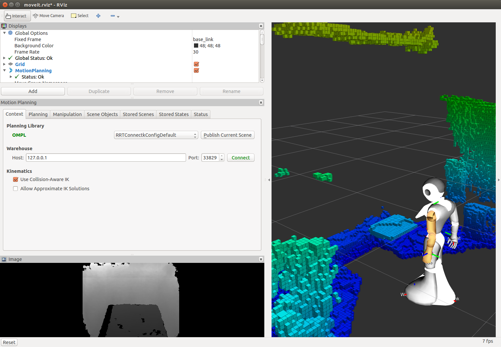

pepper_moveit_config
===================

This is a MoveIt! config package generated by the MoveIt! wizard.
It requires a Pepper model which you can get from here:

https://github.com/ros-naoqi/pepper_robot/tree/master/pepper_description
or from the binary package : ros-indigo-pepper-description

The moveit package must be run on a remote computer and not directly on your robot.

1 Compile the package
=====================

pepper_moveit_config package doesn't need any compilation so running rospack profile should be enough.

And your ready to play with your Pepper

2 Run MoveIt
============

Without a robot
-------------
You can run this moveit package either unconnected to any robot or attached to a robot (real or simulated):
For a standalone execution :

.. code-block:: bash

    roslaunch pepper_moveit_config demo.launch

Once launching the demo, you should see the robot in MoveIt! GUI like this: 

.. image:: tuto/moveit_launch.png
   :width: 100%

Check the box Allow Approximate IK Solutions (and optionally, choose the Planning library), and you are ready to control the robot. 

On a real robot
---------------
To use MoveIt! on a real robot, you need to instanciate ROS controllers on the robot.
To do so, you need:

- `pepper_dcm_bringup <https://github.com/ros-naoqi/pepper_dcm_robot>`_
- `pepper_control <https://github.com/ros-naoqi/pepper_virtual>`_

First, set NAO_IP environment variable to your robot's IP address:

.. code-block:: bash

    export NAO_IP=<YOUR_ROBOT_IP>

Launch the DCM bringup:

.. code-block:: bash

    roslaunch pepper_dcm_bringup pepper_bringup.launch
    
Wait until it is ready, then run:

.. code-block:: bash

    roslaunch pepper_moveit_config moveit_planner.launch

Using visual data from the robot's cameras

It is possible to integrate visual data from the robot's cameras into MoveIt that can be useful for obstacle detection.
There are several ways to acquire visual data:

- using naoqi_driver

  .. code-block:: bash

       roslaunch naoqi_driver naoqi_driver.launch

- using pepper_sensors_py (get data from a single camera)

  .. code-block:: bash

       roslaunch pepper_sensors_py camera.launch

  If you would like to do obstacle detection based on Octomap library integrated in MoveIt, then change the active camera to the depth camera through rqt_reconfigure. 
  You can also tune acquisition parameters if needed:

  .. code-block:: bash

       rosrun rqt_reconfigure rqt_reconfigure

Once depth data are available, you could configure Octomap to represents the robot's space as a set of occupied and free voxels.

On a simulated robot (in Gazebo)
--------------------------------
To use MoveIt! with Gazebo simulation, you need:
   - `pepper_dcm_bringup <https://github.com/ros-naoqi/pepper_dcm_robot>`_
   - `pepper_control <https://github.com/ros-naoqi/pepper_virtual>`_
   - `pepper_gazebo_plugin <https://github.com/ros-naoqi/pepper_virtual>`_

Launch Gazebo, like this:

.. code-block:: bash

    roslaunch pepper_gazebo_plugin pepper_gazebo_plugin_Y20.launch

Wait until it is ready, then click on the Play button in Gazebo.

Finally, start MoveIt!:

.. code-block:: bash

    roslaunch pepper_moveit_config moveit_planner.launch

3 Use Moveit:
=============
Go to MoveIt GUI, and check the box "Allow approximate IK Solutions" on the bottom of the left control panel.
Then, go to the Planning tab.

Select which part of the robot you want to move:
In the plugin list, go to MotionPlanning/Planning Request/Planning Group and choose a roobot's part to control. 
You should see an interactive marker on the chosen robot's part. 

Now, you can control the robot by drag and dropping the interactive markers.
Then, you can compute a trajectory to reach the new position, by clicking the 'Planning' button on the Planning tab.
Once you satisfied by the planned trajectory, you can try it on your real robot by using 'Execute' and/or 'Plan and execute' buttons.

NOTE: The start state is not updated automatically, you have to go to 'Select Start State' select 'Current' and click 'Update'.
